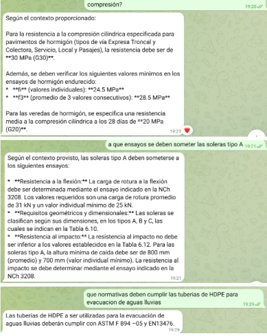
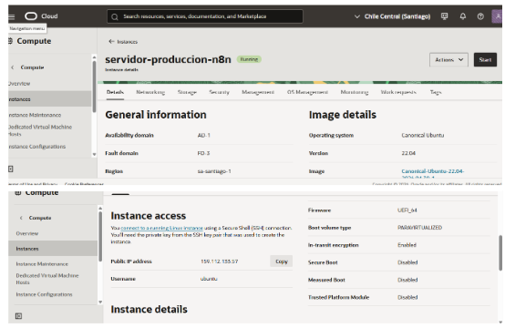

# Challenge Minvu - Agente RAG con Telegram y OCI

## Resumen del proyecto

Implementación de un Agente RAG (Retrieval-Augmented Generation) para un bot de
Telegram desplegado en una instancia de Oracle Cloud Infrastructure (OCI).
El diseño está desacoplado: el bot recibe consultas, el motor RAG realiza la
recuperación semántica desde un vector store y genera respuestas con contexto
documental.

## Arquitectura del Agente RAG

1. Telegram Bot
   - Interfaz de usuario que recibe preguntas de Telegram.
   - Envía la consulta al servicio RAG y devuelve la respuesta generada.

2. Servicio RAG
   - Gestiona el pipeline de consulta.
   - Convierte la pregunta en embeddings.
   - Recupera los fragmentos relevantes desde el vector store.
   - Construye el prompt con el contexto recuperado.
   - Llama al modelo de lenguaje para generar la respuesta.

3. Vector Store
   - Almacena embeddings de los documentos fuente.
   - Permite búsqueda semántica rápida y recuperación de contexto.
   - Puede ser Chroma, FAISS u otro motor compatible con el flujo de embeddings.

4. Modelo de lenguaje
   - Genera la respuesta final usando el contexto recuperado.
   - El prompt está acotado para evitar respuestas alucinadas y asegurar que las
     respuestas se basen en el contenido fuente.

5. Despliegue en OCI
   - El servicio y el bot se ejecutan en una VM de Oracle Cloud Infrastructure.
   - Se mantiene desacoplado para facilitar escalabilidad y mantenimiento.
   - La comunicación entre componentes puede ser local o mediante APIs internas.

## Resolución del problema de memoria RAM (OOM)

Durante las pruebas en la VM de OCI se detectaron errores de memoria insuficiente
(Out Of Memory). La solución aplicada fue:

- Reducir el `batch size` de embeddings a `5`.
- Habilitar memoria virtual utilizando swap en la instancia de OCI.

Con estos ajustes se estabilizó la ejecución del agente y se evitó que el proceso
se terminara por falta de memoria.

## Instrucciones de uso

### Requisitos previos

- Bot de Telegram creado con BotFather.
- Instancia de OCI con acceso SSH.
- Python 3.11+ instalado.
- Dependencias del proyecto instaladas en un entorno virtual.

### Configuración local

1. Clonar el repositorio:

```bash
git clone https://github.com/Davidrstrange546/alura-pavimentacion-agent.git
cd alura-pavimentacion-agent
```

2. Crear y activar el entorno virtual:

```bash
python -m venv .venv
.venv\Scripts\activate
```

3. Instalar dependencias:

```bash
pip install -r requirements.txt
```

4. Configurar variables de entorno:

- `TELEGRAM_BOT_TOKEN`
- `OPENAI_API_KEY` o la variable de API requerida por el modelo de lenguaje.
- Otras variables específicas del vector store o embeddings.

5. Ajustar parámetros de memoria:

- Establecer `BATCH_SIZE=5` o equivalente en el archivo de configuración.
- Activar swap en OCI si la memoria RAM de la VM es limitada.

### Ejecución

1. Iniciar el servicio del agente:

```bash
python main.py
```

2. Iniciar el bot de Telegram si se ejecuta como proceso separado:

```bash
python bot.py
```

3. Enviar mensajes al bot desde Telegram y verificar la respuesta.

## Tecnologías utilizadas

- Telegram Bot API
- Arquitectura RAG (Retrieval-Augmented Generation)
- Vector store para embeddings
- Modelo de lenguaje (LLM)
- Oracle Cloud Infrastructure (OCI)
- Swap para memoria virtual y gestión de OOM
- Python y bibliotecas de NLP

## Archivos relevantes

- `README.md`: documentación principal.
- `requirements.txt`: dependencias del proyecto.
- `main.py` / `bot.py`: entrada de la lógica del servicio y del bot.
- `data/`: documentos fuente para indexación.
- `screenshots/`: carpeta para agregar capturas de pantalla.

## Capturas de pantalla

### Bot funcionando



> Reemplaza esta imagen con la captura de pantalla del bot funcionando.

### Instancia de OCI



> Reemplaza esta imagen con la captura de pantalla de la instancia de OCI y la configuración de swap.

## Notas finales

Este repositorio documenta la entrega para el Challenge de Alura con enfoque en
una arquitectura desacoplada, estabilidad de memoria y despliegue en OCI.
Ajusta las variables y los comandos según la implementación real del proyecto.
